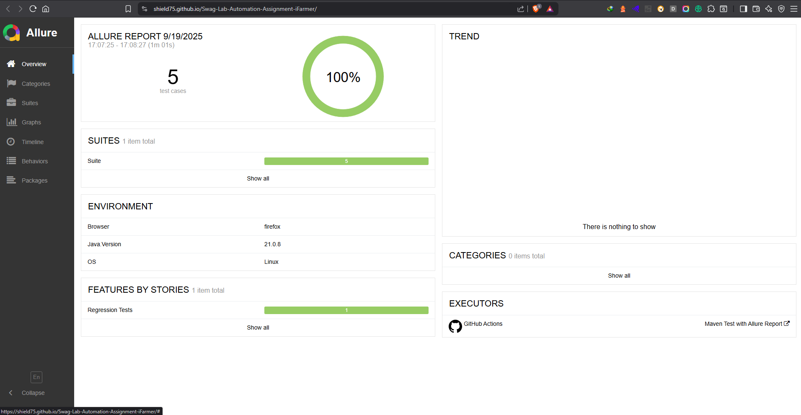
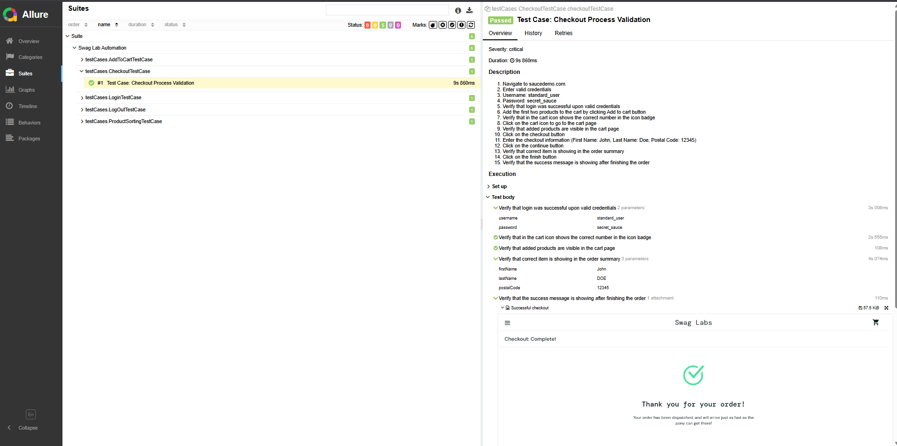
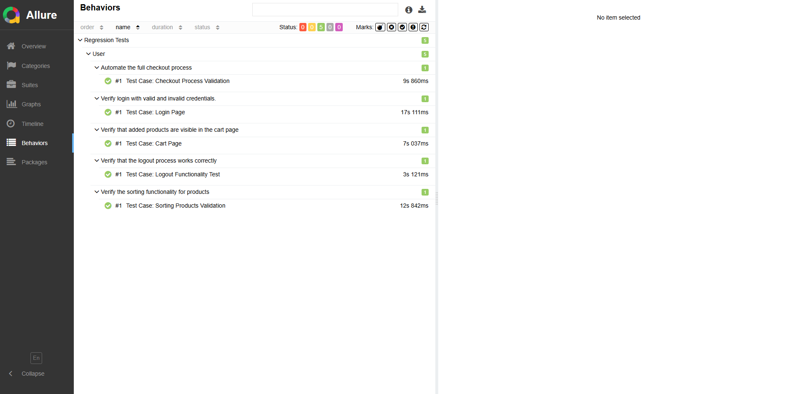

# **Swag Labs Automation**

## **Overview**
Swag Labs Automation is a Selenium and TestNG-based automation testing framework built to validate the functionalities of Swag Labs web application. Designed with modularity and scalability in mind, this framework supports running tests across multiple workflows such as login, cart management, and visual validations, while also leveraging **Allure** for professional-grade reporting.

---

## **Features**
- Fully automated testing for the Swag Labs web application's critical functionalities.
- Supports detailed TestNG test cases and scenarios.
- Modular design using reusable base classes and utility functions.
- Efficient test data management for scenario-based testing.
- Detailed test progress and results reporting using **Allure**.
- Screenshots for both errors and visual validation using **Ashot**.

---

## **Prerequisites**
1. **Java Development Kit (JDK)** version 20 or later.
2. **Maven** for dependency management.
3. **Modern Web Browsers** (Chrome, Firefox, Edge are supported).
4. **Allure Command-Line Tool** for generating test reports:
    - Install Allure via Homebrew (macOS) or Chocolatey (Windows).

---

## **Setup**

1. Clone the repository:
   ```bash
   git clone <repository-url>
   cd Swag-Labs-Automation
   ```

2. Install necessary dependencies:
   ```bash
   mvn clean install
   ```

3. Configure `config.properties` file:
    - Update the values for:
        - `baseURL` - Application's URL (Swag Labs).
        - `browser` - (e.g., Chrome, Firefox).
    - The file is located at: `src/test/resources/config.properties`.

4. Verify your browser drivers using **WebDriverManager**.

---

## **Execution**

### Run All Tests
Run all test cases from the framework:
```bash
mvn test
```

### Run Specific Test Cases
To run specific test cases, edit `testNg.xml` in `src/test/resources`. Add or exclude the test classes you wish to execute.

A sample `testNg.xml` snippet:
```xml
<classes>
    <class name="testCases.LoginTestCase"></class>
    <class name="testCases.AddToCartTestCase"></class>
</classes>
```

---

## **Test Cases**

### **1. LoginTestCase.java**
#### **Description:**
Validates the login functionality under various scenarios.
#### **Test Scenarios:**
- Valid user credentials should log in successfully.
- Invalid credentials should not allow login and an error message should display.
- Login attempt for a non-existent user.
- Empty field validation (username/password).

---

### **2. CartBadgeCountTestCase.java**
#### **Description:**
Verifies the cart badge count functionality.
#### **Test Scenarios:**
- Adding an item should increase the cart badge count by 1.
- Removing an item should decrease the cart badge count by 1.
- Cart badge should display `0` when all items are removed.

---

### **3. AddToCartTestCase.java**
#### **Description:**
Validates the product addition and cart behavior.
#### **Test Scenarios:**
- Single product addition and verification.
- Add multiple products and verify cart contents.
- Verify item prices and total.

---

### **4. LockedOutUserTestCase.java**
#### **Description:**
Tests the application's behavior when a locked-out user attempts to log in.
#### **Test Scenarios:**
- Ensure login is denied for locked-out users.
- Confirm the correct error message is displayed for a locked-out user.

---

### **5. CheckoutProcessTestCase.java**
#### **Description:**
Validates the steps involved during the checkout process.
#### **Test Scenarios:**
- Add items to cart and start checkout.
- Enter valid customer details to proceed.
- Verify successful checkout completion.
- Test incomplete detail submissions.

---

### **6. RemoveFromCartTestCase.java**
#### **Description:**
Tests removing items from the cart functionality.
#### **Test Scenarios:**
- Verify removing a single product works correctly.
- Verify removing all products removes the cart badge.
- Verify back navigation and cart status.

---

### **7. ProductDetailsTestCase.java**
#### **Description:**
Tests product details page functionality.
#### **Test Scenarios:**
- Verify the correct product title, description, and price.
- Navigate back to the product list successfully.

---

### **8. LogoutTestCase.java**
#### **Description:**
Tests the logout functionality of the application.
#### **Test Scenarios:**
- Successful logout from the home page.
- Confirm the user is redirected to the login page after logout.

---

## **Test Reporting**

This framework integrates **Allure** for modern and interactive reporting:

1. **Run Tests**:
   ```bash
   mvn test
   ```

2. **Generate Allure Report**:
   ```bash
   allure generate --clean target/allure-results
   ```

3. **Serve Allure Report**:
   ```bash
   allure serve target/allure-results
   ```

---

## **Sample Test Report**

To present test results, you can include images in the `assets/` folder. Update the README file to reference them as shown below.

### Example:
- **Test Summary Dashboard**:



- **Detailed Test Case Report**:



- **Swag Lab Automation Test Cases**:



---

## **Components Explanation**

### **1. Configurations**
The `configurations` package contains:
- **BaseClass.java**: A parent class for initializing WebDriver and essential setup and custom methods.
- **DriverManager.java**: Handles driver initialization using WebDriverManager.
- **BasePage.java**: Provides reusable web element interaction methods.

---

### **2. Utilities**
The `utilities` package contains data-driven or reusable methods such as:
- **LoginData.java**: Manages login-related test data for better organization.

---

### **3. Test Cases**
The `testCases` package contains all the functional/feature test cases covering Swag Labs workflows.

---

## **Supported Browsers**
The framework supports the following browsers:
- Google Chrome
- Mozilla Firefox
- Microsoft Edge

WebDriverManager provides automatic browser driver setup.

---

## **Contributing**
Feel free to contribute to this project by forking the repository, making necessary changes, and submitting a pull request.

---

## **License**
This project is licensed under [shield75].

---
